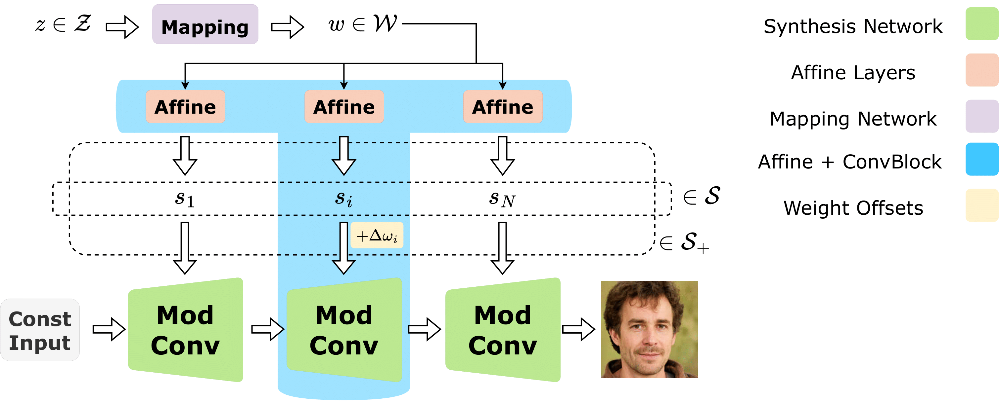
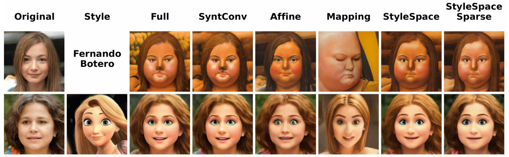
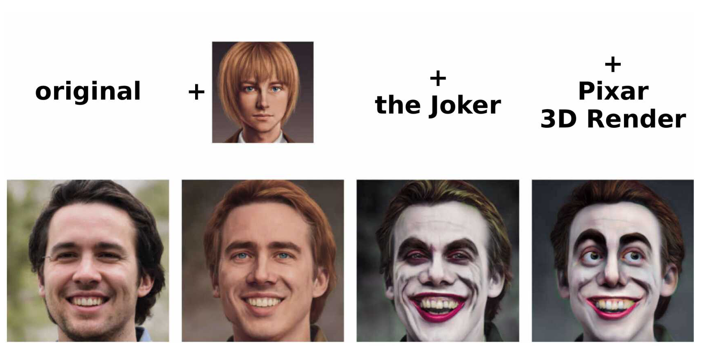
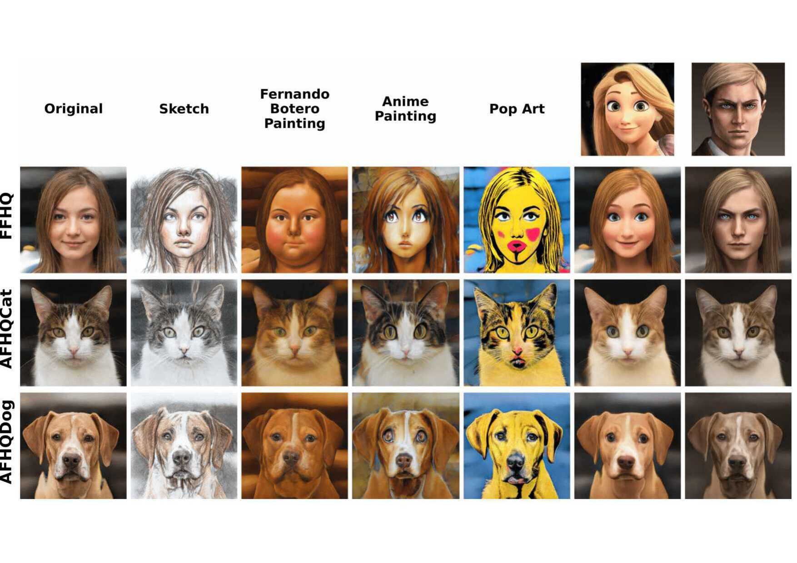
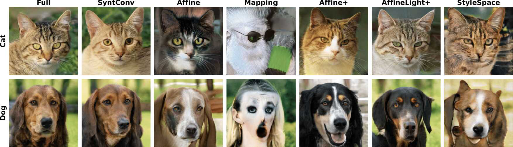
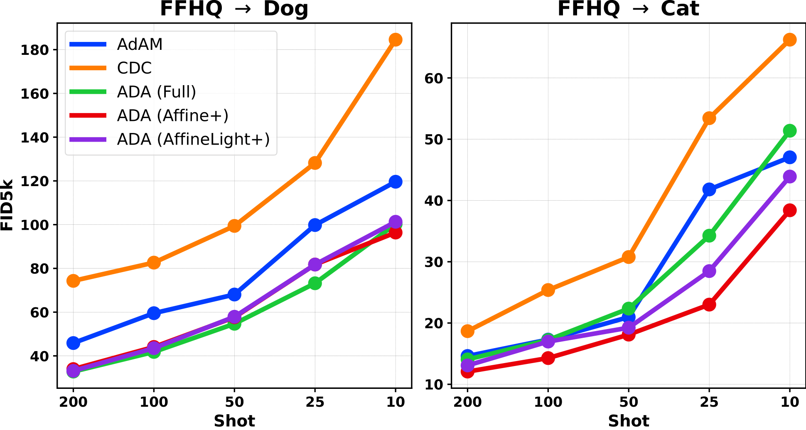

# StyleDomain: Efficient and Lightweight Parameterizations of StyleGAN for One-shot and Few-shot Domain Adaptation (ICCV 2023)

[](https://colab.research.google.com/drive/1aLqsuIOxGLh1bLHGVSfgnyv4y_yfY_Zu?usp=sharing)
[](https://arxiv.org/abs/2212.10229)

[Aibek Alanov*](https://scholar.google.ru/citations?view_op=list_works&hl=en&hl=en&user=MXJTRGoAAAAJ), 
[Vadim Titov*](https://github.com/MACderRu), 
[Maksim Nakhodnov*](https://scholar.google.com/citations?user=AAhWSMsAAAAJ&hl=en&oi=ao),
[Dmitry Vetrov](https://scholar.google.ru/citations?hl=en&user=7HU0UoUAAAAJ) <br>
*Equal contribution <br>

>**Abstract:** Domain adaptation of GANs is a problem of fine-tuning GAN models pretrained on a large dataset (e.g. StyleGAN) to a specific domain with few samples (e.g. painting faces, sketches, etc.). While there are many methods that tackle this problem in different ways, there are still many important questions that remain unanswered. In this paper, we provide a systematic and in-depth analysis of the domain adaptation problem of GANs, focusing on the StyleGAN model. We perform a detailed exploration of the most important parts of StyleGAN that are responsible for adapting the generator to a new domain depending on the similarity between the source and target domains. As a result of this study, we propose new efficient and lightweight parameterizations of StyleGAN for domain adaptation. Particularly, we show that there exist directions in StyleSpace (StyleDomain directions) that are sufficient for adapting to similar domains. For dissimilar domains, we propose Affine+ and AffineLight+ parameterizations that allows us to outperform existing baselines in few-shot adaptation while having significantly less training parameters. Finally, we examine StyleDomain directions and discover their many surprising properties that we apply for domain mixing and cross-domain image morphing.

## Description
The repository consists of two parts: 
- [SimilarDomains](SimilarDomains/) directory is for one-shot domain adaptation to similar domains (i.e. stylizations of faces).
- [DissimilarDomains](DissimilarDomains/) directory is for few-shot domain adaptation to dissimilar dominas (e.g. faces -> dogs, cats).

In our paper we investigate which parts of StyleGAN2 generator are important for one-shot or few-shot domain adaptation. The illustration of considered parameterizations you can see in the following diagram:



As a result of our study, we propose new effective parameterizations: **StyleSpace** for one-shot adaptation and **Affine+/AffineLight+** for few-shot adaptation (see more details in [our paper](https://arxiv.org/abs/2212.10229)).

## One-shot Adaptation to Similar Domains
For similar domains we show that StyleSpace parameterization achieves the same performance as training the full StyleGAN2 generator:



Further we explore surprising properties of StyleSpace domain directions. The first one is **mixability** of such directions, i.e. we can take a linear combination of different domains and the resulting direction will adapt the generator to the semantically mixed domain:



The second property is transferability, i.e. we can transfer StyleSpace directions between StyleGAN2 models trained on different domains:



You can play with different StyleSpace directions in the colab notebooks:

More details about training and inference of StyleSpace directions you can find in [SimilarDomains](SimilarDomains/) directory. 

## Few-shot Adaptation to Dissimilar Domains
We additionally study few-shot regime and propose new Affine+ and AffineLight+ parameterizations that reach the same quality as the full paremeterization while having less paremeters by several orders:



We show that the proposed parameterizations ADA (Affine+) and ADA (AffineLight+) outperform the strong baselines [CDC](https://arxiv.org/abs/2104.06820) and [AdAM](https://arxiv.org/abs/2210.16559):



You can reproduce the study on different parameterization of StyleGAN2 in a few-shot regime and comparisons with baselines by the code from [DissimilarDomains](DissimilarDomains/) directory.

## Getting Started
[SimilarDomains](SimilarDomains/) and [DissimilarDomains](DissimilarDomains/) have its own dependencies and you can find them in their readmes.

## Citation

If you use this code for your research, please cite our paper:

```
@article{alanov2022styledomain,
  title={StyleDomain: Analysis of StyleSpace for Domain Adaptation of StyleGAN},
  author={Alanov, Aibek and Titov, Vadim and Nakhodnov, Maksim and Vetrov, Dmitry},
  journal={arXiv preprint arXiv:2212.10229},
  year={2022}
}
```